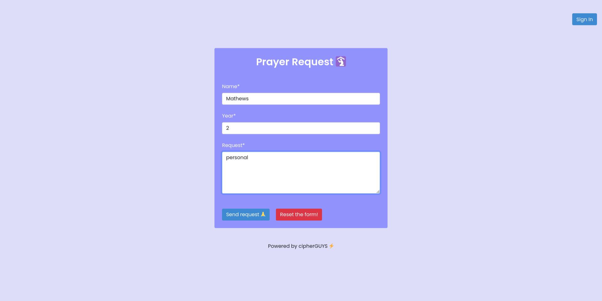
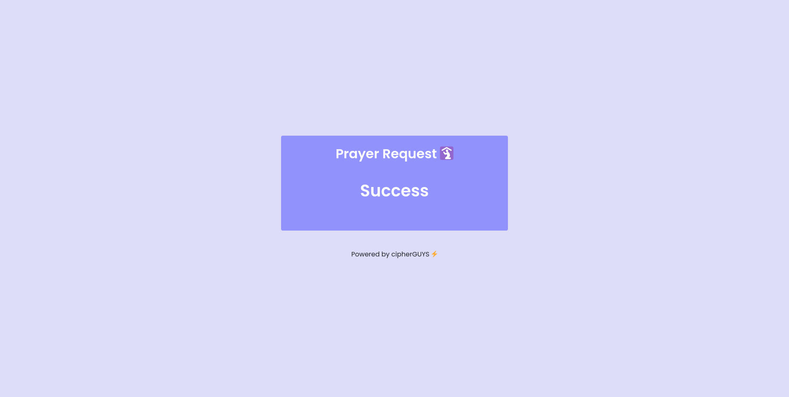
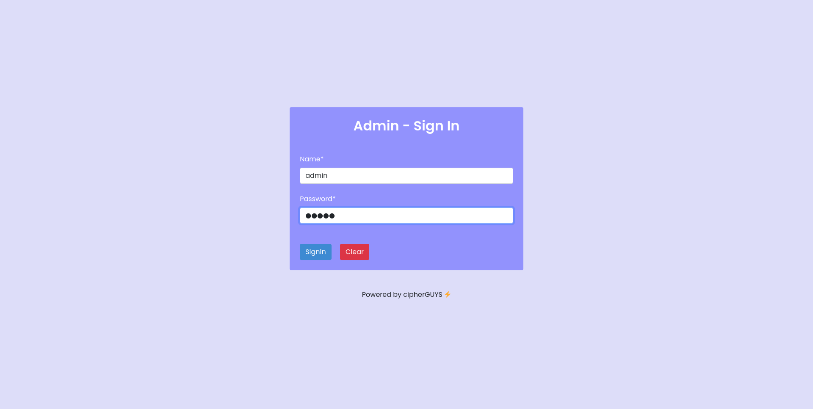
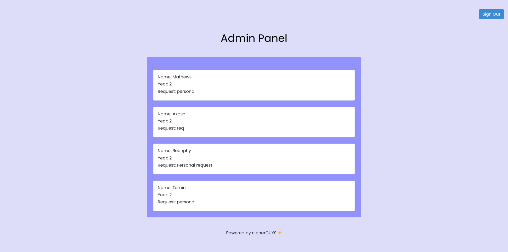

# hacknight-notion

## Link to product walkthrough 🔗
Drive link is <a href="https://drive.google.com/file/d/19nlkeCBN59RKbLs7tS8yj7pHmt-RoYRs/view?usp=sharing">here</a>

 

## How to run 🏃
1. Clone the repo

        git clone https://github.com/cipherGUYS/hacknight-notion/

2. Install the required dependencies
          
        npm install
        
3. Now start the server

        nodemon index.js
        
4. Now open any browser and search
  
         http://localhost:5000/home
         
5. That's All :relieved: 

 

## Routes 🛣️
* /home
* /signin
* /admin

## Snapshots 🖼️

